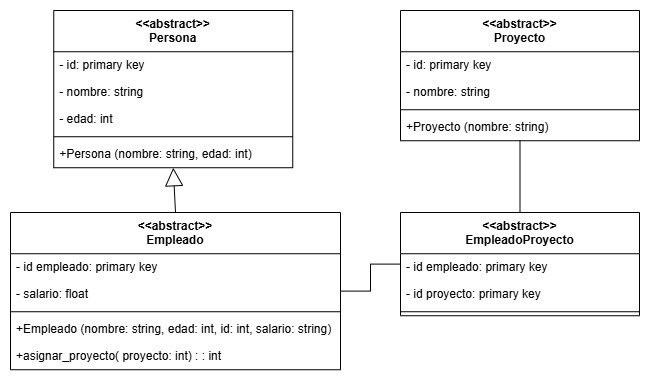

# orm_claseTecProgr
Aquí se describe la actividad de la materia tecnologías de programación del día 07 de noviembre del 2024

# ¿Qué es el desajuste de impedancia y en el mapeo objeto-relacional?
El desajuste de impedancia es el término utilizado para describir las incompatibilidades entre los paradigmas orientado a objetos y relacional. Estas diferencias incluyen la falta de herencia, polimorfismo y encapsulación en el paradigma relacional, así como el uso de clases, objetos y métodos en el paradigma orientado a objetos en comparación con tablas, filas y columnas en el paradigma relacional. (Comunidad de LinkedIn, 2024)
# Considerar ejemplo:
## ¿Cómo se realizaría el mapeo a una base de datos relacional?
### Pasos para realizar el mapeo a una base de datos relacional:

- Definir las entidades y sus relaciones:

  - Identificar las clases en el lenguaje de programación que representan las entidades del dominio.
  - Establecer las relaciones entre estas clases, como asociaciones uno a uno, uno a muchos o muchos a muchos.

- Crear las tablas correspondientes en la base de datos:
  
    - Mapear cada clase a una tabla en la base de datos.
    - Mapear cada atributo de la clase a una columna en la tabla.
    - Definir las claves primarias y foráneas para mantener la integridad referencial.

- Configurar el ORM:
    - Seleccionar una herramienta ORM adecuada para el lenguaje de programación utilizado (por ejemplo, Hibernate para Java,       Entity Framework para .NET, Django ORM para Python).
    - Configurar el ORM para que conozca las clases y sus correspondientes tablas, ya sea mediante anotaciones en el código, archivos de configuración o convenciones de nombres.

- Implementar las operaciones CRUD (Crear, Leer, Actualizar, Eliminar):
    - Utilizar las funcionalidades del ORM para realizar operaciones sobre la base de datos sin necesidad de escribir consultas SQL explícitas.
    - Aprovechar las ventajas del ORM, como la gestión automática de transacciones y la carga diferida de datos.

## Realizar esquema relacional

## ¿Cómo se maneja la herencia al realizar el mapeo?
Al mapear jerarquías de herencia de clases a una base de datos relacional mediante técnicas de Mapeo Objeto-Relacional (ORM), se emplean principalmente tres estrategias: Tabla por jerarquía de clases, Tabla por subclases y Tabla por clase concreta. La elección de cada una depende de varios factores como la aplicación, los requisitos de rendimiento y la complejidad de jerarquía de herencia. 

# Referencias
LinkedIn. (n.d.). ¿Cómo manejar el desajuste de impedancia entre R2TGE? Recuperado el 7 de noviembre de 2024, de https://www.linkedin.com/advice/0/how-can-you-handle-impedance-mismatch-between-r2tge?lang=es&originalSubdomain=es
